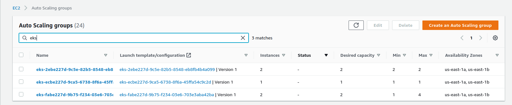

<p align="center">
  <a href="https://dev.to/vumdao">
    
  </a>
</p>
<h1 align="center">
  <div><b>Apache Airflow In Kubernetes</b></div>
</h1>

## Abstract
- **TL;DR**
- [Airflow](https://airflow.apache.org/) is one of the most popular tools for running workflows espeically data-pipeline.
- A successful pipeline moves data efficiently, minimizing pauses and blockages between tasks, keeping every process along the way operational. Apache Airflow provides a single customizable environment for building and managing data pipelines
- In this post, it provides step-by-step to deploy airflow on EKS cluster using Helm for the default chart with customization in `values.yaml`, cdk for creating AWS resources such as EFS, node group with Taints for pod toleration in the SPOT instance.

<p align="center">
  <a href="https://dev.to/vumdao">
    
  </a>
</p>

## Table Of Contents
 * [Architecture Overview](#Architecture-Overview)
 * [Using CDK to create EFS and Access Point (AP)](#Using-CDK-to-create-EFS-and-Access-Point-(AP))
 * [Install EFS CSI Driver using helm-chart within airflow workers only](#Install-EFS-CSI-Driver-using-helm-chart-within-airflow-workers-only)
 * [Create EFS storage class, PV, and PVC](#Create-EFS-storage-class,-PV,-and-PVC)
 * [Use CDK to create airflow IAM role](#Use-CDK-to-create-airflow-IAM-role)
 * [Use CDK to create Auto scaling groups (ASG)](#Use-CDK-to-create-Auto-scaling-groups-(ASG))
 * [Set up gitlab repo for git-sync sidecar](#Set-up-gitlab-repo-for-git-sync-sidecar)
 * [Create values.yaml](#Create-values.yaml)
 * [Airflow secrets](#Airflow-secrets)
 * [Deploy Airflow using helm chart](#Deploy-Airflow-using-helm-chart)
 * [Create airflow ingress](#Create-airflow-ingress)
 * [Conclusion](#Conclusion)

---

## 🚀 **Architecture Overview** <a name="Architecture-Overview"></a>
- This blog guide you deploy airflow on an existing EKS cluster using namespace `airflow` and its own resources
- Prerequiste:
  - EKS cluster
  - IAM admin role or enough permission to create AWS resources
  - CDK installation (Typescript)
  - Helm-chart


- **Airflow components**: Worker, scheduler, web server, flower. Other things are airflow database, redis and sync.
- **Use EFS** to share logs, DAGs between components such as worker, scheduler and webserver. Plus use EFS to store airflow database metadata
- There are 3 **node groups**:
  - On-demand EC2: workers (If you can control the retries of Airflow task and DAGS, this group is better to use Spot instances instead)
  - On-demand EC2: Airflow database, pgBouncer and redis
  - Spot-fleet EC2: Schedulers, webs, and other components

---

## 🚀 **Using CDK to create EFS and Access Point (AP)** <a name="Using-CDK-to-create-EFS-and-Access-Point-(AP)"></a>
- It's neccessary to create EFS as a way to persistent airflow DAGs, logs between workers and scheduler
- Checkout [AWS EKS With EFS CSI Driver And IRSA Using CDK](https://dev.to/awscommunity-asean/aws-eks-with-efs-csi-driver-and-irsa-using-cdk-dgc) to undestand AWS EFS and CSI Driver provisioner
- Create EFS within the `VPC` of EKS cluster and add `security group` for open access from EKS nodes

<details>
<summary>efs-stack.ts</summary>

```
import * as efs from '@aws-cdk/aws-efs';
import * as ec2 from '@aws-cdk/aws-ec2';
import { RemovalPolicy, App, Stack, StackProps, Tags } from '@aws-cdk/core';


export class AirflowEfsStack extends Stack {
  constructor(scope: App, id: string, pattern: string, vpc: ec2.IVpc, ip: string, env_tag: string, props?: StackProps) {
    super(scope, id, props);

    const securityGroup = new ec2.SecurityGroup(this, 'AirflowEfsSG', {
      vpc,
      securityGroupName: `${pattern}-airflow-sg`,
      description: 'Security group for EFS CSI',
      allowAllOutbound: true
    })
    securityGroup.addIngressRule(ec2.Peer.ipv4(ip), ec2.Port.allTraffic(), 'Allow internal private vpc')

    Tags.of(securityGroup).add('Name', `${pattern}-efs-sg`)
    Tags.of(securityGroup).add('cdk:sg:stack', 'sg-stack')
    Tags.of(securityGroup).add('env', env_tag)

    const fileSystem = new efs.FileSystem(
      this, 'AirflowEFS', {
        vpc,
        securityGroup,
        fileSystemName: `${pattern}-airflow-efs`,
        lifecyclePolicy: efs.LifecyclePolicy.AFTER_14_DAYS,
        removalPolicy: RemovalPolicy.DESTROY
      }
    )
    Tags.of(fileSystem).add('Name', `${pattern}-airflow-efs`)
    Tags.of(fileSystem).add('cdk:efs:stack', `${pattern}-efs-${env_tag}`)
    Tags.of(fileSystem).add('env', env_tag)

    const fsAcccessPoint = fileSystem.addAccessPoint(
      `${pattern}EFSAccesPoint`, {
        posixUser: {
          uid: '1001',
          gid: '1001'
        },
        createAcl: {
          ownerUid: '1001',
          ownerGid: '1001',
          permissions: '0700'
        },
        path: '/airflow/data'
      }
    )
    Tags.of(fsAcccessPoint).add('Name', `${pattern}-data-airflow-pg`)
  }
}
```
</details>


## 🚀 **Install EFS CSI Driver using helm-chart within airflow workers only** <a name="Install-EFS-CSI-Driver-using-helm-chart-within-airflow-workers-only"></a>
- CSI driver provisioner is DaemonSet, it will deploy to all worker nodes as default but we can restrict to run EFS `kube-system` pods for airflow nodes only by adding toleration and affinity in `values.yaml`

<details>
<summary>values.yaml</summary>

```
controller:
  tolerations:
    - key: 'dedicated'
      operator: 'Equal'
      value: 'airflow'
      effect: 'NoSchedule'
  affinity:
    nodeAffinity:
      requiredDuringSchedulingIgnoredDuringExecution:
        nodeSelectorTerms:
        - matchExpressions:
          - key: role
            operator: In
            values:
            - airflow

node:
  tolerations:
    - key: 'dedicated'
      operator: 'Equal'
      value: 'airflow'
      effect: 'NoSchedule'
  nodeSelector:
    role: airflow
```

</details>

- Deploy
```
helm repo add aws-efs-csi-driver <https://kubernetes-sigs.github.io/aws-efs-csi-driver/>
helm repo update
helm upgrade -i aws-efs-csi-driver aws-efs-csi-driver/aws-efs-csi-driver --values efs-values.yaml -n kube-system
```

## 🚀 **Create EFS storage class, PV, and PVC** <a name="Create-EFS-storage-class,-PV,-and-PVC"></a>
- Pre-requisite: EFS and AP IDs which are created from previous step
- Update the EFS and AP ID to the storage class and persistent volume then create them

<details>
<summary>pvc.yaml</summary>

```
kind: StorageClass
apiVersion: storage.k8s.io/v1
metadata:
  name: af-efs-sc
provisioner: efs.csi.aws.com
parameters:
  provisioningMode: efs-ap
  fileSystemId: fs-3529be16
  directoryPerms: "700"
  gidRangeStart: "1000"
  gidRangeEnd: "2000"
---
apiVersion: v1
kind: PersistentVolume
metadata:
  name: af-efs-pg-pv
spec:
  capacity:
    storage: 8Gi
  volumeMode: Filesystem
  accessModes:
    - ReadWriteMany
  persistentVolumeReclaimPolicy: Retain
  storageClassName: af-efs-sc
  csi:
    driver: efs.csi.aws.com
    volumeHandle: fs-3529be15::fsap-0679931424ff5f0ce
---
apiVersion: v1
kind: PersistentVolumeClaim
metadata:
  name: data-airflow-postgresql
spec:
  accessModes:
    - ReadWriteMany
  storageClassName: af-efs-sc
  resources:
    requests:
      storage: 8Gi
```

</details>

- Get PVC, we will need this to update to `values.yaml` later
```
$ kubectl get pvc
NAME                      STATUS   VOLUME                                     CAPACITY   ACCESS MODES   STORAGECLASS   AGE
data-airflow-postgresql   Bound    efs-pg-pv                                  8Gi        RWX            efs-sc         29h
```

## 🚀 **Use CDK to create airflow IAM role** <a name="Use-CDK-to-create-airflow-IAM-role"></a>
- Best practice is to use IAM role service account (IRSA), but within airflow we can create its own role as instance profile with permission for node to join EKS cluster and permission to read/write EFS or other AWS resources

<details>
<summary>iamRole.ts</summary>

```
    createWorkerRole(): IRole {
        // Airflow IAM worker role
        const worker_role = new Role(
            this, 'AirflowIamRole', {
                assumedBy: new ServicePrincipal('ec2.amazonaws.com'),
                roleName: `${this.eksCluserName}-airflow`
            }
        );
        const attachPolicies = ['AmazonEC2ContainerRegistryReadOnly', 'AmazonEKSWorkerNodePolicy', 'AmazonS3ReadOnlyAccess', 'AmazonEKS_CNI_Policy'];
        for (var policy of attachPolicies) {
            worker_role.addManagedPolicy(ManagedPolicy.fromAwsManagedPolicyName(policy))
        }
        Tags.of(worker_role).add('Name', `${this.eksCluserName}-airflow`)
        Tags.of(worker_role).add('cdk:iam:stack', `${this.pattern}-iam-${this.env_tag}`)
        Tags.of(worker_role).add('env', this.env_tag)

        const autoscalingStatement = new PolicyStatement({
            sid: 'AutoScalingGroup',
            actions: [
                "autoscaling:DescribeAutoScalingGroups",
                "autoscaling:DescribeAutoScalingInstances",
                "autoscaling:DescribeLaunchConfigurations",
                "autoscaling:DescribeTags",
                "autoscaling:CreateOrUpdateTags",
                "autoscaling:UpdateAutoScalingGroup",
                "autoscaling:TerminateInstanceInAutoScalingGroup",
                "ec2:DescribeLaunchTemplateVersions",
                "elasticfilesystem:*",
                "tag:GetResources",
            ],
            effect: Effect.ALLOW,
            resources: ['*'],
            conditions: {
                'StringEquals': {"aws:RequestedRegion": this.region}
            }
        });

        worker_role.addToPolicy(autoscalingStatement);

        return worker_role;
    };
```

</details>

- **Note**: ASG launch template will add this Airflow role to `aws-auth` configmap `mapRoles` for joining new nodes to the EKS cluster
- Checkout [AWS EKS - Launch Template Of Node Group](https://dev.to/aws-builders/aws-eks-launch-template-of-node-group-6a4) for understanding how IAM role in nodegroup works

## 🚀 **Use CDK to create Auto scaling groups (ASG)** <a name="Use-CDK-to-create-Auto-scaling-groups-(ASG)"></a>
- Why do we need auto scaling here? In order to handle work loads between when running workflows
- Create a manage node group with spot instances for saving cost? Of course we should care about spot instance might be interrupted. If a workflow task gets interrupted due to node termination, you may lose a part of progress, but the cost of losing ten minutes of progress is much lower than losing four hours of work.
- Using Spot instances for long-running tasks can be disruptive if node running the task gets terminated by Spot. Consider breaking long-running tasks into multiple sub-tasks with a shorter execution time that can be used to checkpoint a workflow’s progress.
- We also recommend that you configure automatic retries in DAGs, especially when using Spot.

- Two autoscaling groups: Instance types are based on the need of Airflow processes such as workload, data size, number of DAGs, tasks and their complexity
  - ASG-pet: min 2, max 2
    - spot: 100%
    - type: `c5a.xlarge`, `c5a.large`
    - components: 2 sch, 2 web, 1 flower, 1 sync
  - ASG-sts (stateful set): min 1, max 3
    - calculate the number of workers and auto-scaling
    - spot: 100%
    - type: `c5a.2xlarge`, `c5a.large`
    - components: workers
  - ASG-db (database): min 1, max 1
    - on-demand: 100%
    - type: `c5a.xlarge`
    - components: airflow database, redis, pgBouncer

<details>
<summary>asg-stack.ts</summary>

```
import { Stack, App, Tags, StackProps} from '@aws-cdk/core';
import { Cluster, Nodegroup, CapacityType, TaintEffect } from '@aws-cdk/aws-eks'
import { Role, ServicePrincipal, ManagedPolicy, PolicyStatement, Effect, IRole } from '@aws-cdk/aws-iam';
import * as ec2 from '@aws-cdk/aws-ec2';

interface Ec2Type {
    pet: Array<string>,
    pet_size: Array<number>,
    sts: string,
    sts_size: Array<number>,
    db: string
};

export class AirflowAsgStack extends Stack {
    public eks_cluster: any;
    public worker_role: any;
    public airflowSG: any;
    public eksCluserName: string;
    public launchTemplate: any;

    constructor(public scope: App, id: string, public pattern: string, public vpc: ec2.IVpc, public vpcSg: ec2.ISecurityGroup,
                public region: string, public ip: string, ec2_types: Ec2Type, public env_tag: string, props?: StackProps) {
        super(scope, id, props);

        this.eksCluserName = 'us-eks'

        // EKS cluster
        this.eks_cluster = Cluster.fromClusterAttributes(
            this, `EksCluster${pattern.toUpperCase()}`, {
                vpc,
                clusterName: this.eksCluserName
            }
        );

        this.launchTemplate = this.createLaunchTemplate();

        // Airflow-SG to workers
        this.airflowSG = this.createAirflowSG();

        this.worker_role = this.createWorkerRole();

        this.createAsgPet(ec2_types.pet, ec2_types.pet_size);

        this.createAsgSts(ec2_types.sts, ec2_types.sts_size);

        this.createAsgDb(ec2_types.db);

    };

    createAirflowSG(): any {
        /**
         * Airflow security group
         */
        const airflowSG = new ec2.SecurityGroup(this, 'AirflowairflowSG', {
            vpc: this.vpc,
            securityGroupName: 'airflow-priv-sg',
            description: 'Security group to access to worker in private vpc',
            allowAllOutbound: true
        });
        airflowSG.connections.allowFrom(airflowSG, ec2.Port.allTcp(), 'Allow node to communicate with each other');
        airflowSG.connections.allowFrom(this.vpcSg, ec2.Port.allTcp(), 'Allow nodes in another ASG communicate to airflow nodes');
        Tags.of(airflowSG).add('Name', 'airflow-priv-ssh-sg');
        Tags.of(airflowSG).add('cdk:sg:stack', `${this.pattern}-sg-${this.env_tag}`);
        Tags.of(airflowSG).add('env', this.env_tag);

        return airflowSG;
    };

    createLaunchTemplate(): any {
        /**
         * More about launch-templates: https://github.com/awsdocs/amazon-eks-user-guide/blob/master/doc_source/launch-templates.md
         * Notes:
         * - Nodegroup auto-generates role if not specify
         * - Launch template node group automatically add the worker role to aws-auth configmap
        */
        const airflowLaunchTemplate = new ec2.LaunchTemplate(this, 'AirflowLaunchTemplate-lt', {
            launchTemplateName: 'airflow-asg-lt',
            securityGroup: this.airflowSG,
            blockDevices: [{
                deviceName: '/dev/xvda',
                volume: ec2.BlockDeviceVolume.ebs(20)
            }],
            keyName: `${this.pattern}-airflow`
        });
        Tags.of(airflowLaunchTemplate).add('Name', 'airflow-asg-lt');
        Tags.of(airflowLaunchTemplate).add('cdk:lt:stack', `${this.pattern}:lt:${this.env_tag}`);
        Tags.of(airflowLaunchTemplate).add('env', this.env_tag);

        return airflowLaunchTemplate;
    }

    createAsgPet(types: Array<string>, sizes: Array<number>) {
        /**
         * ASG Pet is used to assign deployments. Due to using spot instances so recommendation min size 2
         */
        const asgNodeGroupName = 'eks-airflow-nodegroup-pet';

        const asgPet = new Nodegroup(this, 'AirflowPetAsg', {
            nodegroupName: 'eks-airflow-nodegroup-pet',
            subnets: this.eks_cluster.vpc.selectSubnets({subnetType: ec2.SubnetType.PRIVATE}),
            cluster: this.eks_cluster,
            capacityType: CapacityType.SPOT,
            nodeRole: this.worker_role,
            instanceTypes: [
                new ec2.InstanceType(types[0]),
                new ec2.InstanceType(types[1])
            ],
            minSize: sizes[0],
            maxSize: sizes[1],
            labels: {
                'role': 'airflow',
                'type': 'af-stateless',
                'lifecycle': 'spot'
            },
            taints: [
                {
                    effect: TaintEffect.NO_SCHEDULE,
                    key: 'dedicated',
                    value: 'airflow'
                }
            ],
            tags: {
                'Name': 'eks-airflow-nodegroup-pet',
                'cdk:asg:stack': `${this.pattern}-asg-${this.env_tag}`
            },
            launchTemplateSpec: {
                id: this.launchTemplate.launchTemplateId!
            }
        });
    };

    createAsgSts(type: string, sizes: Array<number>) {
        /**
         * ASG STS: Assign Airflow workers
         */
        const asgNodeGroupName = 'eks-airflow-nodegroup-sts';

        const asgStatefulSet = new Nodegroup(this, 'AirflowStsAsg', {
            nodegroupName: asgNodeGroupName,
            subnets: this.eks_cluster.vpc.selectSubnets({subnetType: ec2.SubnetType.PRIVATE}),
            cluster: this.eks_cluster,
            nodeRole: this.worker_role,
            instanceTypes: [new ec2.InstanceType(type)],
            capacityType: CapacityType.SPOT,
            minSize: sizes[0],
            maxSize: sizes[1],
            labels: {
                'role': 'airflow',
                'type': 'af-stateful',
                'lifecycle': 'spot'
            },
            taints: [
                {
                    effect: TaintEffect.NO_SCHEDULE,
                    key: 'dedicated',
                    value: 'airflow'
                }
            ],
            tags: {
                'Name': 'eks-airflow-nodegroup-sts',
                'cdk:asg:stack': `${this.pattern}-asg-${this.env_tag}`
            },
            launchTemplateSpec: {
                id: this.launchTemplate.launchTemplateId!
            }
        });
    };

    createAsgDb(type: string) {
        /**
         * ASG Db: Assign Airflow database and redis to this worker group
         */
        const asgNodeGroupName = 'eks-airflow-nodegroup-db';

        const asgStatefulSet = new Nodegroup(this, 'AirflowDbAsg', {
            nodegroupName: asgNodeGroupName,
            subnets: this.eks_cluster.vpc.selectSubnets({subnetType: ec2.SubnetType.PRIVATE}),
            cluster: this.eks_cluster,
            nodeRole: this.worker_role,
            instanceTypes: [new ec2.InstanceType(type)],
            capacityType: CapacityType.ON_DEMAND,
            minSize: 1,
            maxSize: 1,
            labels: {
                'role': 'airflow',
                'type': 'af-db',
                'lifecycle': 'on-demand'
            },
            taints: [
                {
                    effect: TaintEffect.NO_SCHEDULE,
                    key: 'dedicated',
                    value: 'airflow'
                }
            ],
            tags: {
                'Name': 'eks-airflow-nodegroup-db',
                'cdk:asg:stack': `${this.pattern}-asg-${this.env_tag}`
            },
            launchTemplateSpec: {
                id: this.launchTemplate.launchTemplateId!
            }
        });
    };
}
```

</details>

- Deploy

```
$ cdk deploy AirflowAsgStackUS
```

- Check result

```
# kf get node |grep 20-eks
ip-172-10-13-169.us-east-1.compute.internal   Ready    <none>   2d2h    v1.18.20-eks-c9f1ce
ip-172-10-41-179.us-east-1.compute.internal   Ready    <none>   2d14h   v1.18.20-eks-c9f1ce
ip-172-10-51-199.us-east-1.compute.internal   Ready    <none>   23h     v1.18.20-eks-c9f1ce
```



- **IMPORTANT:** The above code contains creating Airflow security group, you should checkout [Understand Pods communication](https://dev.to/aws-builders/understand-pods-communication-338c) for deep understanding how EKS node join EKS cluster and how Pods communicate

## 🚀 **Set up gitlab repo for git-sync sidecar** <a name="Set-up-gitlab-repo-for-git-sync-sidecar"></a>
- Create new project to store DAGs on Git and let git-sync update DAGs automatically.


- Create user `airflow` and add to project as reporter/developer


- Generate its token as impersonating which will be used later


## 🚀 **Create values.yaml** <a name="Create-values.yaml"></a>
- **values.yaml** is used to customize some attributes from airflow helm chart to adapt with our system and deployments such as credentials, Airflow configs, Pods assignment, autoscaling, etc.

- Use community airflow helm chart (not the official one). Template `values.yaml` from [airflow-helm/charts](https://github.com/airflow-helm/charts/blob/main/charts/airflow/values.yaml)**

- Customizations
  - **1. Update airflow image if you'd like to deploy from your own one or use latest public one**
    ```
    airflow:
      image:
        repository: apache/airflow
        tag: 2.1.4-python3.9
        pullPolicy: IfNotPresent
    ```

  - **2. Persist airflow logs using EFS**

    <details>
    <summary>logs</summary>

    ```
    airflow:
      kubernetesPodTemplate:
        securityContext:
          fsGroup: 65534
      sync:
        securityContext:
          fsGroup: 65534
    scheduler:
      securityContext:
        fsGroup: 65534
    web:
      securityContext:
        fsGroup: 65534
    workers:
      securityContext:
        fsGroup: 65534
    flower:
      securityContext:
        fsGroup: 65534
    logs:
      ## the airflow logs folder
      ##
      path: /opt/airflow/efs/logs
      persistence:
        enabled: true
        subPath: ""
        storageClass: "efs-sc"
        accessMode: ReadWriteMany
        size: 1Gi
    ```
    
    </details>

    Reference to [How to persist airflow logs?](https://github.com/airflow-helm/charts/tree/main/charts/airflow#how-to-persist-airflow-logs) for more options.

  - **3. Update `web.service.type` to `NodePort` for later use Ingress**
    ```
    web:
      service:
        type: NodePort
    ```

  - **4. Set up `workers` replicas for balance workload**
    [How to set up celery worker autoscaling?](https://github.com/airflow-helm/charts/tree/main/charts/airflow#workers)

  - **5. Add toleration to airflow components**
    - Airflow nodes will only accept airflow Pods
    - Global setting `airflow.defaultTolerations`

    ```
      defaultTolerations:
      - key: 'dedicated'
        operator: 'Equal'
        value: 'airflow'
        effect: 'NoSchedule'
    ```
    - For other extra components such as `postgresql`, `redis`, `pgBouncer` we need to add `tolerations` at each field

  - **6. Add `nodeAffinity` to assign airflow components to their node group**
    - For deployment services such as web, scheduler, sync, flower
      ```
        affinity:
          nodeAffinity:
            requiredDuringSchedulingIgnoredDuringExecution:
              nodeSelectorTerms:
                - matchExpressions:
                  - key: type
                    operator: In
                    values:
                      - af-stateless
      ```
    - For stateful service such as workers
      ```
        affinity:
          nodeAffinity:
            requiredDuringSchedulingIgnoredDuringExecution:
              nodeSelectorTerms:
                - matchExpressions:
                  - key: type
                    operator: In
                    values:
                      - af-stateful
      ```
    - For postgresql, redis, pgBouncer
      ```
      affinity:
        nodeAffinity:
          requiredDuringSchedulingIgnoredDuringExecution:
            nodeSelectorTerms:
              - matchExpressions:
                - key: type
                  operator: In
                  values:
                    - af-db
      ```

  - **7. Persit DAGs using git-sync**

    - **7.1 git-sync sidecar (SSH auth)**
      - Pre-requiste: Create Linux user `airflow`, generate its rsa ssh-key, add public key to `airflow` gitlab user and then use `id_rsa` to generate secret
        ```
        $ kubectl create secret generic \
            airflow-ssh-git-secret \
            --from-file=id_rsa=$(pwd)/id_rsa \
            --namespace airflow

        secret/airflow-ssh-git-secret created
        ```

        - Get gitlab known_hosts
        ```
        ssh-keyscan -H gitlab.cloudopz.co >> known_hosts
        ```

        - Update `values.yaml` at `dags.gitSync`
        ```
        dags:
          ## the airflow dags folder
          ##
          path: /opt/airflow/efs/dags
          gitSync:
            enabled: true
            repo: "git@gitlab.cloudopz.co:devops/airflow-dags.git"
            branch: "master"
            revision: "HEAD"
            syncWait: 60
            sshSecret: "airflow-ssh-git-secret"
            sshSecretKey: "id_rsa"
            
            # "known_hosts" verification can be disabled by setting to "" 
            sshKnownHosts: |-
              gitlab.cloudopz.co ssh-rsa AAAAB3NzaC1yc2EAAAADAQABAAABAQDD18bjpsGTussTrWvrU9LzqDdb0DJ5XVlOvmv4E+svIN6ItUvS3UrNNKiABs9IlexsEnDTdYTfZkV14Ft7f79lTeLKqvEJowF6RZg1SDOtW4ljPxRUh8n8MgGftI37m3baRYBqdsSbTebjfDRkykgI3k5AW+Lw9syeckncL3ZLAUQ894bh/uIqu4tCP59UlxZ43B6n6nna9g+ZFz/EGCsQTxPsTUIy13Lrgeh6kLQk77zvxdz838/JDH7ELdmd1nwCJIXOKhFwwSDkRUAkHgVSHWsFZdfNM4Na3TRBR0IUCnEqwDuEqSlTh1yfv1oymu6FeA/JaiTgfhvDVleB4wSx
        ```

    - **7.2 git-sync sidecar (HTTP auth)**
      - Create secret with gitlab token key get from ["Set up gitlab repo for git-sync sidecar"](#Set-up-gitlab-repo-for-git-sync-sidecar)
        ```
        kubectl create secret generic \
          airflow-http-git-secret \
          --from-literal=username=airflow \
          --from-literal=password=EKZvPi8TCKVaNSz45rjn \
          --namespace airflow
        ```

      - Update `values.yaml` at `dags.gitSync`
        ```
        dags:
          ## the airflow dags folder
          ##
          path: /opt/airflow/efs/dags
          gitSync:
            enabled: true
            repo: "https://gitlab.cloudopz.co/devops/airflow-dags.git"
            branch: "master"
            revision: "HEAD"
            syncWait: 60
            httpSecret: "airflow-http-git-secret"
            httpSecretUsernameKey: username
            httpSecretPasswordKey: password
        ```

  - **8. Database - PostgreSQL Chart with enabling debug and using EFS**
    - We already created the PVC from [Create EFS Access Point for postgresql volume](#Create-EFS-Access-Point-for-postgresql-volume)
    - Update `values.yaml` (Note: DEBUG enabled is optional)
      ```
      postgresql:
        enabled: true
        postgresqlDatabase: airflow
        postgresqlUsername: postgres
        postgresqlPassword: airflow
        existingSecretKey: "postgresql-password"
        extraEnv:
          - name: BITNAMI_DEBUG
            value: "true"
        persistence:
          enabled: true
          storageClass: "efs-sc"
          existingClaim: "data-airflow-postgresql"
          accessModes:
            - ReadWriteMany
          size: 8Gi

        master:
          podAnnotations:
            cluster-autoscaler.kubernetes.io/safe-to-evict: "true"
        
        volumePermissions:
          enabled: true
      ```

  - **9. Create Airflow variables**
    - We can use plain/text or Secrets/Configmaps
    - [How-to](https://github.com/airflow-helm/charts/tree/main/charts/airflow#how-to-create-airflow-variables)

  - **10. Generate Fernet**
    - Airflow uses [Fernet](https://github.com/fernet/spec/) to encrypt passwords in the connection configuration and the variable configuration. It guarantees that a password encrypted using it cannot be manipulated or read without the key. Fernet is an implementation of symmetric (also known as “secret key”) authenticated cryptography.
    - Generating Fernet key
      ```
      from cryptography.fernet import Fernet
      fernet_key= Fernet.generate_key()
      print(fernet_key.decode()) # your fernet_key, keep it in secured place!
      ```

## 🚀 Airflow secrets <a name="Airflow-secrets"></a>
- For airflow users, reference to [Access Control](https://airflow.apache.org/docs/apache-airflow/stable/security/access-control.html) to assign proper permissions.

  <details>
  <summary>airflow-secret.yaml</summary>

  ```
  apiVersion: v1
  kind: Secret
  metadata:
    name: airflow-secret
    namespace: airflow
  data:
    airflow-admin-password: ==
    airflow-user-password:  
    airflow-viewer-password: =
    
    airflow-fernet: =

    clh-password: ==

    db_user: 
    db_password: 

    ttdb_user: =
    ttdb_password: ==

    slack_host: 
    slack_webhook: ==

    # airflow database
    postgresql-password: =

    # git-sync access token
    airflow-gitlab-user: ==
    airflow-gitlab-token: =
  ```

  </details>

## 🚀 **Deploy Airflow using helm chart** <a name="Deploy-Airflow-using-helm-chart"></a>
- The community usage helm chart
```
# add this repo as "airflow-stable"
helm repo add airflow-stable https://airflow-helm.github.io/charts
helm repo update

kubectl create namespace airflow
helm upgrade -i "airflow" airflow-stable/airflow \
  --version "8.5.2" \
  --namespace "airflow" \
  --values values.yaml
```

- Check PVC
```
$ kubectl get pvc
NAME                      STATUS   VOLUME                                     CAPACITY   ACCESS MODES   STORAGECLASS   AGE
airflow-logs              Bound    pvc-177df93c-331f-4514-9733-9e67be7612ee   1Gi        RWX            af-efs-sc      7d18h
data-airflow-postgresql   Bound    af-efs-pg-pv                               8Gi        RWX            af-efs-sc      8d
```


- Check pods
```
$ kubectl get pod -owide
NAME                                  READY   STATUS      RESTARTS   AGE   IP             NODE                                              NOMINATED NODE   READINESS GATES
NAME                                        READY   STATUS    RESTARTS   AGE     IP            NODE                          NOMINATED NODE   READINESS GATES
airflow-db-migrations-8666f9b775-p9n6p      2/2     Running   0          7d2h    10.0.7.85     ip-10-0-7-188.ec2.internal    <none>           <none>
airflow-flower-79bf6f7b95-mst9x             2/2     Running   0          6d15h   10.0.6.117    ip-10-0-6-175.ec2.internal    <none>           <none>
airflow-pgbouncer-75b9ddcf89-q8vkf          1/1     Running   0          7d2h    10.0.9.109    ip-10-0-9-82.ec2.internal     <none>           <none>
airflow-postgresql-0                        1/1     Running   0          7d2h    10.0.9.65     ip-10-0-9-82.ec2.internal     <none>           <none>
airflow-redis-master-0                      1/1     Running   0          7d2h    10.0.9.237    ip-10-0-9-82.ec2.internal     <none>           <none>
airflow-scheduler-6dc74f564f-44tzx          2/2     Running   0          6d15h   10.0.6.33     ip-10-0-6-175.ec2.internal    <none>           <none>
airflow-scheduler-6dc74f564f-cb5d4          2/2     Running   0          7d2h    10.0.15.232   ip-10-0-15-181.ec2.internal   <none>           <none>
airflow-sync-connections-8579c86d44-dg9jq   2/2     Running   0          6d15h   10.0.15.150   ip-10-0-15-181.ec2.internal   <none>           <none>
airflow-sync-pools-7f4f55776b-qdcjn         2/2     Running   0          6d15h   10.0.6.203    ip-10-0-6-175.ec2.internal    <none>           <none>
airflow-sync-users-6d98bb49ff-zx5rs         2/2     Running   0          6d15h   10.0.15.140   ip-10-0-15-181.ec2.internal   <none>           <none>
airflow-sync-variables-7f9959cd-j8p8x       2/2     Running   0          6d15h   10.0.6.27     ip-10-0-6-175.ec2.internal    <none>           <none>
airflow-web-7f46664c6c-bvgls                2/2     Running   0          7d2h    10.0.15.111   ip-10-0-15-181.ec2.internal   <none>           <none>
airflow-web-7f46664c6c-vq6kr                2/2     Running   0          6d15h   10.0.6.4      ip-10-0-6-175.ec2.internal    <none>           <none>
airflow-worker-0                            2/2     Running   0          7d2h    10.0.7.100    ip-10-0-7-188.ec2.internal    <none>           <none>
airflow-worker-1                            2/2     Running   0          7d2h    10.0.14.153   ip-10-0-14-28.ec2.internal    <none>           <none>
```

- We see that the two workers locate on different nodes. Check node to be taints and pods are in toleration
```
$ kubectl describe node ip-10-0-7-188.ec2.internal | grep Taints -B 1
CreationTimestamp:  Thu, 15 Jul 2021 07:19:29 +0000
Taints:             dedicated=airflow:NoSchedule

kubectl describe pod airflow-worker-0 |grep Tolerations
Tolerations:     dedicated=airflow:NoSchedule

$ kubectl describe pod airflow-worker-1 |grep Tolerations
Tolerations:     dedicated=airflow:NoSchedule
```

- Check git-sync for up-to-date DAGs. The DAG file `101_postgres_operator.py`


```
$ kubectl exec -it airflow-worker-0 -- ls -la efs/dags/repo/
Defaulting container name to airflow-worker.
Use 'kubectl describe pod/airflow-worker-0 -n airflow' to see all of the containers in this pod.
total 8
drwxr-sr-x 2 65533 nogroup   67 Jul 15 16:33 .
drwxrwsrwx 4 root  nogroup   82 Jul 15 16:33 ..
-rw-r--r-- 1 65533 nogroup   71 Jul 15 16:33 .git
-rw-r--r-- 1 65533 nogroup 3221 Jul 15 16:33 101_postgres_operator.py
-rw-r--r-- 1 65533 nogroup    0 Jul 15 16:33 README.md
```

## 🚀 **Create airflow ingress** <a name="Create-airflow-ingress"></a>

<details>
<summary>airflowingress.k8s.yaml</summary>

```
apiVersion: networking.k8s.io/v1beta1
kind: Ingress
metadata:
  annotations:
    alb.ingress.kubernetes.io/backend-protocol: HTTP
    alb.ingress.kubernetes.io/certificate-arn: arn:aws:acm:ap-northeast-2:123456789012:certificate/b8299bf5-ae3b-4f69-zzzz-xxxxyyyy
    alb.ingress.kubernetes.io/group.name: dev
    alb.ingress.kubernetes.io/group.order: "9"
    alb.ingress.kubernetes.io/listen-ports: '[{"HTTPS":443}]'
    kubernetes.io/ingress.class: alb
  labels:
    dev: airflow
  name: airflow
  namespace: airflow
spec:
  rules:
    - host: airflow.vinceredev.com
      http:
        paths:
          - backend:
              serviceName: airflow-web
              servicePort: 8080
```

</details>


## 🚀 **Conclusion** <a name="Conclusion"></a>
- With all of steps above, you can now deploy airflow in EKS cluster with control assigment of airflow components to AWS node group
- By using Amazon EC2 Spot, you can reduce your spend on EC2 instances significantly with minimal configuration changes.
- By using EFS with CSI driver you can persite data, logs cross multiple zones.
- By using CDK, you get more familiar to create IaC and Kubernetes yaml as code.

---

<h3 align="center">
  <a href="https://dev.to/vumdao">:stars: Blog</a>
  <span> · </span>
  <a href="https://github.com/vumdao/aws-eks-the-hard-way">Github</a>
  <span> · </span>
  <a href="https://stackoverflow.com/users/11430272/vumdao">stackoverflow</a>
  <span> · </span>
  <a href="https://www.linkedin.com/in/vu-dao-9280ab43/">Linkedin</a>
  <span> · </span>
  <a href="https://www.linkedin.com/groups/12488649/">Group</a>
  <span> · </span>
  <a href="https://www.facebook.com/CloudOpz-104917804863956">Page</a>
  <span> · </span>
  <a href="https://twitter.com/VuDao81124667">Twitter :stars:</a>
</h3>